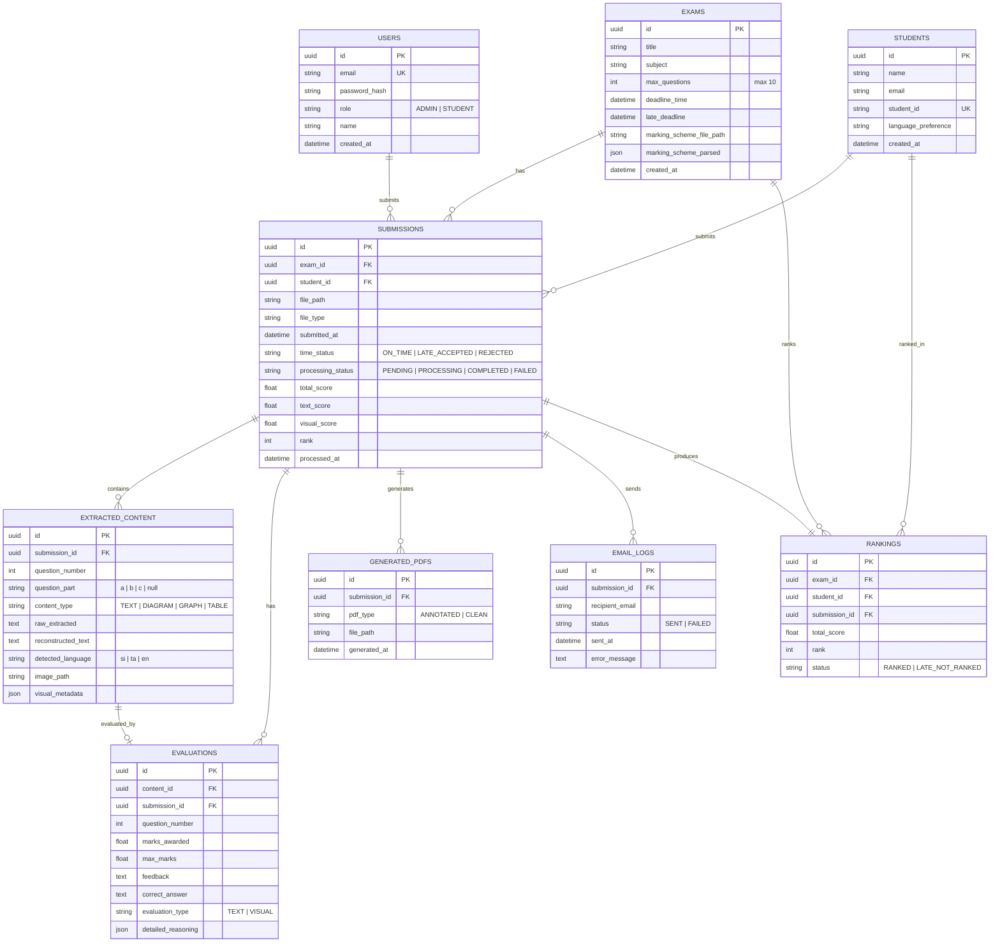

# AI-Powered Multilingual Intelligent Paper Marking System

## Implementation Plan

An advanced AI-driven platform that reads handwritten/typed exam papers in Sinhala, Tamil, and English, reconstructs unclear handwriting, understands visual content (diagrams, graphs, tables), evaluates answers using LLM reasoning, applies time-based submission rules, generates annotated PDFs, sends results via email, and provides a full admin dashboard.

---

## Resolved Decisions

| Question | Decision |
|:---------|:---------|
| **Exam Structure** | Max 10 essay questions per exam, with sub-parts (Q1a, Q1b, etc.) |
| **Marking Scheme** | Uploaded as a **PDF file** → parsed by GPT-4o Vision into structured JSON |
| **Multiple Exams** | Yes — multiple exams and subjects supported |
| **Authentication** | Admin + Student login needed (simple JWT auth, **built last**) |
| **Deployment** | Local development first → deploy later |
| **File Storage** | Local filesystem first → cloud storage later |

> [!IMPORTANT]
> **Prerequisites**: You need a funded **OpenAI API key** (GPT-4o access) and a **local PostgreSQL** instance running.

---

## Technology Stack

| Layer | Technology | Purpose |
|:------|:-----------|:--------|
| **Frontend** | Next.js 16 + TypeScript | Admin dashboard & UI |
| **UI Library** | shadcn/ui + Tailwind CSS 4 | Premium component library |
| **Charts** | Recharts | Analytics & score visualizations |
| **Backend** | FastAPI (Python) | REST API server |
| **Database** | PostgreSQL | Persistent data storage |
| **ORM** | SQLAlchemy 2.0+ (async) | Database abstraction |
| **Migrations** | Alembic | Schema version control |
| **AI - Vision/LLM** | OpenAI GPT-4o API | OCR, handwriting, evaluation, visual understanding |
| **Image Processing** | OpenCV + Pillow | Pre-processing images before AI |
| **PDF Read/Annotate** | PyMuPDF (fitz) | Read PDFs, add annotations |
| **PDF Generate** | ReportLab | Generate clean rewritten PDFs |
| **Email** | smtplib + email.mime | Send results via SMTP |
| **Task Queue** | FastAPI BackgroundTasks | Async paper processing |
| **File Storage** | Local filesystem (`./uploads/`) | Store uploaded papers & generated PDFs |

---

## Database Schema (PostgreSQL)



### Key Design Decisions
- **UUIDs** for all primary keys (secure, no guessable IDs)
- **USERS table** for simple JWT auth (admin + student roles, built last)
- **Marking scheme PDF** uploaded and stored as file; GPT-4o Vision parses it into `marking_scheme_parsed` JSON
- **`question_part`** supports sub-parts: `a`, `b`, `c`, etc. (max 10 questions × sub-parts)
- **`time_status`** computed on upload based on exam deadlines
- **`processing_status`** tracks the async pipeline progress
- Separate **`EXTRACTED_CONTENT`** table per question allows granular tracking of text vs visual content
- **`RANKINGS`** table computed after all submissions are processed

---

## Proposed Changes

### Phase 1 — Database + Core Backend Setup

#### [NEW] [database.py](file:///d:/Projects/ai-paper-marking/backend/database.py)
- Async SQLAlchemy engine + session factory using `asyncpg`
- `get_db()` dependency for FastAPI route injection
- Database URL from environment variables

#### [NEW] [models.py](file:///d:/Projects/ai-paper-marking/backend/models.py)
- SQLAlchemy ORM models for all 8 tables defined above
- Using SQLAlchemy 2.0 `Mapped[]` / `mapped_column()` syntax
- Relationships between models

#### [NEW] [schemas.py](file:///d:/Projects/ai-paper-marking/backend/schemas.py)
- Pydantic V2 schemas for request/response validation
- `ExamCreate`, `ExamResponse`, `SubmissionCreate`, `SubmissionResponse`
- `EvaluationResponse`, `RankingResponse`, `DashboardStats`

#### [NEW] [config.py](file:///d:/Projects/ai-paper-marking/backend/config.py)
- Pydantic `BaseSettings` for environment variable management
- OpenAI API key, DB URL, SMTP settings, file paths, time rules

#### [NEW] [.env](file:///d:/Projects/ai-paper-marking/backend/.env)
- Template environment file with all required variables

#### [NEW] [alembic.ini](file:///d:/Projects/ai-paper-marking/alembic.ini) + [migrations/](file:///d:/Projects/ai-paper-marking/migrations/)
- Alembic configuration for database migrations
- Initial migration to create all tables

#### [MODIFY] [requirements.txt](file:///d:/Projects/ai-paper-marking/backend/requirements.txt)
Full dependency list:
```
fastapi
uvicorn[standard]
python-multipart
pydantic
pydantic-settings
sqlalchemy[asyncio]
asyncpg
alembic
openai
opencv-python-headless
Pillow
PyMuPDF
reportlab
python-dotenv
aiofiles
```

#### [MODIFY] [main.py](file:///d:/Projects/ai-paper-marking/backend/main.py)
- Add CORS middleware (for Next.js frontend)
- Add lifespan handler for DB connection
- Include all route routers
- Static file serving for uploads

---

### Phase 2 — Paper Upload + Time Validation

#### [NEW] [routes/upload.py](file:///d:/Projects/ai-paper-marking/backend/routes/upload.py)
- `POST /api/upload` — Accept PDF/image uploads with student ID + exam ID
- Validate file type (PDF, PNG, JPG)
- Save to `./uploads/{exam_id}/{submission_id}/`
- Call `time_validator` to determine submission status
- Create `Submission` record in DB
- If `ON_TIME` or `LATE_ACCEPTED`: trigger background processing pipeline
- If `REJECTED`: return rejection response

#### [MODIFY] [services/time_validator.py](file:///d:/Projects/ai-paper-marking/backend/services/time_validator.py)
```python
def validate_submission_time(submitted_at: datetime, exam: Exam) -> str:
    """
    Returns: ON_TIME | LATE_ACCEPTED | REJECTED
    
    Rules:
    - submitted_at <= exam.deadline_time → ON_TIME
    - exam.deadline_time < submitted_at <= exam.late_deadline → LATE_ACCEPTED  
    - submitted_at > exam.late_deadline → REJECTED
    """
```

#### [NEW] [routes/exams.py](file:///d:/Projects/ai-paper-marking/backend/routes/exams.py)
- `POST /api/exams` — Create exam with subject, title, deadlines + **upload marking scheme PDF**
- `GET /api/exams` — List all exams (filterable by subject)
- `GET /api/exams/{id}` — Get exam details + parsed marking scheme
- `PUT /api/exams/{id}` — Update exam
- `DELETE /api/exams/{id}` — Delete exam

#### [NEW] [services/marking_scheme_parser.py](file:///d:/Projects/ai-paper-marking/backend/services/marking_scheme_parser.py)
```python
async def parse_marking_scheme_pdf(file_path: str) -> dict:
    """
    1. Convert marking scheme PDF pages to images (PyMuPDF)
    2. Send to GPT-4o Vision with structured output schema
    3. Extract: question numbers, sub-parts, model answers,
       max marks per question, answer type (TEXT/VISUAL)
    4. Return structured JSON stored in exam.marking_scheme_parsed
    """
```

#### [NEW] [routes/students.py](file:///d:/Projects/ai-paper-marking/backend/routes/students.py)
- `POST /api/students` — Register student
- `GET /api/students` — List students
- `GET /api/students/{id}` — Get student details

---

### Phase 3 — Vision Reader (OCR + Handwriting Extraction)

#### [MODIFY] [services/vision_reader.py](file:///d:/Projects/ai-paper-marking/backend/services/vision_reader.py)
Core OCR module using OpenAI GPT-4o Vision:

```python
async def extract_content_from_pages(file_path: str, exam: Exam) -> list[ExtractedContent]:
    """
    1. Convert PDF pages to images (PyMuPDF)
    2. Pre-process images (OpenCV: deskew, contrast, denoise)
    3. Send each page to GPT-4o Vision with structured prompt:
       - "Extract all handwritten and printed text"
       - "Identify question numbers"
       - "Flag any diagrams, graphs, or tables with bounding descriptions"
       - "Detect the language (Sinhala/Tamil/English)"
    4. Parse structured response into ExtractedContent records
    5. Return list of extracted content per question
    """
```

Key implementation details:
- Use `detail: "high"` for GPT-4o Vision to capture fine handwriting details
- Structured output with JSON schema to ensure consistent question-number mapping
- Language detection included in the same API call (no separate service needed)
- Images stored temporarily in `./uploads/{submission_id}/pages/`

---

### Phase 4 — Handwriting Reconstruction

#### [MODIFY] [services/text_rewriter.py](file:///d:/Projects/ai-paper-marking/backend/services/text_rewriter.py)
```python
async def reconstruct_handwriting(extracted: ExtractedContent) -> str:
    """
    Takes raw extracted text (potentially messy/garbled from handwriting)
    and uses GPT-4o to:
    1. Clean up OCR artifacts
    2. Fix character-level errors
    3. Reconstruct coherent sentences
    4. Preserve the ORIGINAL language (Sinhala/Tamil/English)
    5. NOT translate — only clean and restructure
    
    Returns: clean, reconstructed text
    """
```

- Uses language-aware prompting: "This is {language} handwritten text. Reconstruct clearly without translating."
- For Sinhala/Tamil: extra prompt guidance to handle Unicode combining characters

---

### Phase 5 — AI Text Evaluation

#### [MODIFY] [services/evaluator.py](file:///d:/Projects/ai-paper-marking/backend/services/evaluator.py)
```python
async def evaluate_text_answer(
    question: str,
    model_answer: str,
    student_answer: str,
    max_marks: float,
    language: str
) -> EvaluationResult:
    """
    Uses GPT-4o to evaluate the student's text answer against the model answer.
    
    Structured output:
    {
        "marks_awarded": 7.5,
        "max_marks": 10,
        "feedback": "Good explanation of photosynthesis but missed the light-dependent reactions",
        "correct_answer": "The complete answer should include...",
        "detailed_reasoning": {
            "key_points_covered": [...],
            "key_points_missed": [...],
            "accuracy": "high",
            "completeness": "partial"
        }
    }
    """
```

- Uses OpenAI Structured Outputs (`response_format`) for guaranteed JSON schema adherence
- Language-aware: evaluates in the same language as the answer
- Partial marking supported (not just binary correct/incorrect)

---

### Phase 6 — Visual Understanding + Visual Evaluation

#### [MODIFY] [services/diagram_detector.py](file:///d:/Projects/ai-paper-marking/backend/services/diagram_detector.py)
```python
async def detect_and_classify_visuals(page_image: bytes) -> list[VisualElement]:
    """
    Uses GPT-4o Vision to detect visual elements in a page:
    - Diagrams (circuits, biology diagrams, etc.)
    - Graphs (line, bar, pie charts)
    - Tables (data tables)
    
    Returns list with type, description, and bounding region info
    """
```

#### [MODIFY] [services/graph_analyzer.py](file:///d:/Projects/ai-paper-marking/backend/services/graph_analyzer.py)
```python
async def analyze_graph(image: bytes, question_context: str) -> GraphAnalysis:
    """
    GPT-4o Vision analyzes a graph:
    - Detect axes labels and units
    - Identify data points/trends
    - Determine graph type
    - Extract trend direction (increasing/decreasing/periodic)
    - Compare with expected graph from marking scheme
    """
```

#### [MODIFY] [services/table_extractor.py](file:///d:/Projects/ai-paper-marking/backend/services/table_extractor.py)
```python
async def extract_table(image: bytes) -> TableData:
    """
    GPT-4o Vision extracts table data:
    - Identify headers
    - Extract rows and columns
    - Return as structured JSON
    - Validate data types and values
    """
```

#### [MODIFY] [services/visual_evaluator.py](file:///d:/Projects/ai-paper-marking/backend/services/visual_evaluator.py)
```python
async def evaluate_visual_answer(
    visual_type: str,  # DIAGRAM | GRAPH | TABLE
    visual_data: dict,
    model_answer: dict,
    max_marks: float
) -> EvaluationResult:
    """
    Evaluates visual answers:
    - Graph: correct axes, correct trend, correct values
    - Table: correct headers, correct data, correct calculations
    - Diagram: correct components, correct connections, correct labels
    
    Returns marks + feedback
    """
```

---

### Phase 7 — Processing Pipeline Orchestrator

#### [NEW] [services/pipeline.py](file:///d:/Projects/ai-paper-marking/backend/services/pipeline.py)
The master orchestrator that coordinates the entire marking flow:

```python
async def process_submission(submission_id: uuid, db: AsyncSession):
    """
    Full pipeline:
    1. Load submission + exam marking scheme
    2. Extract content (vision_reader)
    3. For each question:
       a. If TEXT → reconstruct → evaluate_text
       b. If VISUAL → detect_type → analyze → evaluate_visual
    4. Calculate total score (text_score + visual_score)
    5. Generate annotated PDF
    6. Generate clean rewritten PDF
    7. Send email with results
    8. Update submission status to COMPLETED
    """
```

---

### Phase 8 — Annotation + PDF Generation

#### [MODIFY] [services/annotation.py](file:///d:/Projects/ai-paper-marking/backend/services/annotation.py)
```python
async def annotate_paper(submission: Submission, evaluations: list[Evaluation]) -> str:
    """
    Uses PyMuPDF to overlay annotations on the original paper:
    - ✔ Green checkmarks next to correct answers
    - ❌ Red crosses next to incorrect answers
    - 📝 Feedback text near each answer
    - 🔢 Marks for each question
    - Corrections on diagrams (text callouts)
    - Total score on first/last page
    
    Returns: path to annotated PDF
    """
```

#### [MODIFY] [services/pdf_generator.py](file:///d:/Projects/ai-paper-marking/backend/services/pdf_generator.py)
```python
async def generate_clean_paper(submission: Submission, contents: list, evaluations: list) -> str:
    """
    Uses ReportLab to generate a clean, rewritten answer sheet:
    - Header: Student name, ID, exam title, date
    - Per question:
      - Clean reconstructed answer
      - Marks awarded / max marks
      - Feedback
      - Correct answer (if wrong)
    - Footer: Total score, percentage
    
    Supports Sinhala/Tamil/English text rendering (using appropriate fonts)
    
    Returns: path to clean PDF
    """
```

> [!WARNING]
> **Sinhala/Tamil PDF Rendering**: ReportLab requires TTF font files for Sinhala (e.g., `Iskoola Pota`) and Tamil (e.g., `Latha` or `Noto Sans Tamil`). These fonts must be bundled with the project or installed on the system.

---

### Phase 9 — Email Service

#### [MODIFY] [services/email_service.py](file:///d:/Projects/ai-paper-marking/backend/services/email_service.py)
```python
async def send_result_email(
    student: Student,
    submission: Submission,
    annotated_pdf_path: str,
    clean_pdf_path: str
) -> bool:
    """
    Sends email with:
    - Subject: "Your {exam_title} Results"
    - Body: Summary (total score, percentage, time status)
    - Attachments: Annotated PDF + Clean PDF
    
    Uses SMTP (Gmail/configured provider)
    Logs result to EMAIL_LOGS table
    """
```

---

### Phase 10 — Ranking System

#### [NEW] [routes/rankings.py](file:///d:/Projects/ai-paper-marking/backend/routes/rankings.py)
- `POST /api/exams/{id}/generate-rankings` — Compute rankings for an exam
- `GET /api/exams/{id}/rankings` — Get leaderboard

#### [NEW] [services/ranking_service.py](file:///d:/Projects/ai-paper-marking/backend/services/ranking_service.py)
```python
async def generate_rankings(exam_id: uuid, db: AsyncSession) -> list[Ranking]:
    """
    1. Query all COMPLETED submissions for the exam
    2. Filter only ON_TIME submissions for ranking
    3. Sort by total_score descending
    4. Assign ranks (handle ties with same rank)
    5. Mark LATE_ACCEPTED as 'LATE_NOT_RANKED'
    6. Save to RANKINGS table
    7. Return leaderboard
    """
```

---

### Phase 11 — API Routes (Dashboard Data)

#### [NEW] [routes/submissions.py](file:///d:/Projects/ai-paper-marking/backend/routes/submissions.py)
- `GET /api/submissions` — List all submissions (with filters: exam, status, time_status)
- `GET /api/submissions/{id}` — Get full submission details (content + evaluations)
- `GET /api/submissions/{id}/pdfs` — Get download links for generated PDFs

#### [NEW] [routes/dashboard.py](file:///d:/Projects/ai-paper-marking/backend/routes/dashboard.py)
- `GET /api/dashboard/stats` — Aggregate stats (total submissions, avg score, on-time/late/rejected counts)
- `GET /api/dashboard/analytics` — Score distribution, per-question analytics
- `GET /api/exams/{id}/summary` — Per-exam summary

---

### Phase 12 — Next.js Frontend (Admin Dashboard)

#### Frontend Setup
```bash
cd frontend
npm install @shadcn/ui recharts lucide-react axios date-fns
npx shadcn@latest init
```

#### [MODIFY] [frontend/app/page.tsx](file:///d:/Projects/ai-paper-marking/frontend/app/page.tsx)
- Dashboard home page with:
  - Summary cards (total submissions, avg score, pending, completed)
  - Recent submissions table
  - Score distribution chart
  - Quick actions (create exam, view rankings)

#### [NEW] [frontend/app/exams/page.tsx](file:///d:/Projects/ai-paper-marking/frontend/app/exams/page.tsx)
- List all exams with status indicators
- Create new exam dialog/form

#### [NEW] [frontend/app/exams/[id]/page.tsx](file:///d:/Projects/ai-paper-marking/frontend/app/exams/%5Bid%5D/page.tsx)
- Exam detail: submissions list, marking scheme, rankings
- Tabs: Submissions | Rankings | Analytics

#### [NEW] [frontend/app/upload/page.tsx](file:///d:/Projects/ai-paper-marking/frontend/app/upload/page.tsx)
- Student paper upload form
- Drag & drop zone
- Real-time processing status via polling

#### [NEW] [frontend/app/submissions/[id]/page.tsx](file:///d:/Projects/ai-paper-marking/frontend/app/submissions/%5Bid%5D/page.tsx)
- Full submission detail view
- Side-by-side: original paper vs annotated paper
- Per-question evaluation breakdown
- Download PDFs

#### [NEW] [frontend/app/rankings/[examId]/page.tsx](file:///d:/Projects/ai-paper-marking/frontend/app/rankings/%5BexamId%5D/page.tsx)
- Leaderboard table
- Late submissions separate section
- Export to CSV

#### Key Frontend Components

| Component | Purpose |
|:----------|:--------|
| `components/Sidebar.tsx` | Navigation sidebar |
| `components/StatsCard.tsx` | Dashboard metric cards |
| `components/SubmissionTable.tsx` | Sortable/filterable submissions table |
| `components/ScoreChart.tsx` | Score distribution chart (Recharts) |
| `components/FileUpload.tsx` | Drag & drop file upload with progress |
| `components/PDFViewer.tsx` | Embedded PDF viewer |
| `components/RankingTable.tsx` | Leaderboard table |
| `components/ExamForm.tsx` | Create/edit exam form |
| `components/EvaluationCard.tsx` | Per-question evaluation display |
| `components/TimeStatusBadge.tsx` | Color-coded ON_TIME/LATE/REJECTED badge |

#### [NEW] [frontend/utils/api.ts](file:///d:/Projects/ai-paper-marking/frontend/utils/api.ts)
- Axios instance with base URL configuration
- API helper functions for all endpoints
- Error handling wrapper

---

## Folder Structure (Final)

```
ai-paper-marking/
├── backend/
│   ├── main.py                    # FastAPI app entry point
│   ├── config.py                  # Settings & environment variables
│   ├── database.py                # Async DB engine & session
│   ├── models.py                  # SQLAlchemy ORM models
│   ├── schemas.py                 # Pydantic validation schemas
│   ├── requirements.txt           # Python dependencies
│   ├── .env                       # Environment variables
│   ├── routes/
│   │   ├── __init__.py
│   │   ├── upload.py              # Paper upload endpoint
│   │   ├── exams.py               # Exam CRUD
│   │   ├── students.py            # Student CRUD
│   │   ├── submissions.py         # Submission queries
│   │   ├── rankings.py            # Ranking endpoints
│   │   └── dashboard.py           # Dashboard analytics
│   ├── services/
│   │   ├── __init__.py
│   │   ├── pipeline.py            # Master processing orchestrator
│   │   ├── vision_reader.py       # GPT-4o Vision OCR
│   │   ├── text_rewriter.py       # Handwriting reconstruction
│   │   ├── evaluator.py           # Text answer evaluation
│   │   ├── diagram_detector.py    # Visual element detection
│   │   ├── graph_analyzer.py      # Graph analysis
│   │   ├── table_extractor.py     # Table extraction
│   │   ├── visual_evaluator.py    # Visual answer evaluation
│   │   ├── annotation.py          # PDF annotation (PyMuPDF)
│   │   ├── pdf_generator.py       # Clean PDF generation (ReportLab)
│   │   ├── email_service.py       # SMTP email delivery
│   │   ├── time_validator.py      # Submission time rules
│   │   └── ranking_service.py     # Ranking computation
│   └── uploads/                   # Uploaded files (gitignored)
│
├── frontend/
│   ├── app/
│   │   ├── page.tsx               # Dashboard home
│   │   ├── layout.tsx             # Root layout with sidebar
│   │   ├── globals.css
│   │   ├── exams/
│   │   │   ├── page.tsx           # Exam list
│   │   │   └── [id]/page.tsx      # Exam detail
│   │   ├── upload/
│   │   │   └── page.tsx           # Upload form
│   │   ├── submissions/
│   │   │   └── [id]/page.tsx      # Submission detail
│   │   └── rankings/
│   │       └── [examId]/page.tsx  # Leaderboard
│   ├── components/
│   │   ├── Sidebar.tsx
│   │   ├── StatsCard.tsx
│   │   ├── SubmissionTable.tsx
│   │   ├── ScoreChart.tsx
│   │   ├── FileUpload.tsx
│   │   ├── PDFViewer.tsx
│   │   ├── RankingTable.tsx
│   │   ├── ExamForm.tsx
│   │   ├── EvaluationCard.tsx
│   │   └── TimeStatusBadge.tsx
│   ├── utils/
│   │   └── api.ts
│   └── package.json
│
├── alembic.ini
├── migrations/
│   └── versions/
└── README.md
```

---

## Implementation Phases (Execution Order)

| Phase | Description | Est. Files |
|:------|:------------|:-----------|
| **1** | Database + Core Backend Setup (models, config, DB, schemas) | 6 files |
| **2** | Upload + Time Validation + Marking Scheme PDF Parser | 4 files |
| **3** | Vision Reader — GPT-4o OCR + content extraction | 1 file |
| **4** | Handwriting Reconstruction service | 1 file |
| **5** | AI Text Evaluation service | 1 file |
| **6** | Visual Understanding (diagram, graph, table) + Visual Evaluation | 4 files |
| **7** | Pipeline Orchestrator — ties everything together | 1 file |
| **8** | Annotation (PyMuPDF) + PDF Generation (ReportLab) + Email | 3 files |
| **9** | Ranking System | 2 files |
| **10** | Dashboard API Routes | 2 files |
| **11** | Frontend — Dashboard + all pages & components | ~15 files |
| **12** | Simple JWT Auth (Admin + Student login) | 3 files |
| **13** | Testing + Polish | — |

---

## Verification Plan

### Automated Tests
1. **Database**: Run Alembic migrations → verify all tables created
2. **Time Validator**: Unit tests with mock datetimes for all 3 statuses
3. **Upload API**: Test file upload with valid/invalid files
4. **Pipeline**: End-to-end test with a sample paper image
5. **Backend**: `uvicorn backend.main:app --reload` — verify all routes respond

### Manual Verification
1. **Upload a sample paper** (English handwritten) → verify extraction
2. **Check evaluation output** → verify marks and feedback quality
3. **Download annotated PDF** → verify annotations are correctly placed
4. **Download clean PDF** → verify formatting and content
5. **Test time rules** → submit at different simulated times
6. **Test ranking** → verify ON_TIME ranked, LATE not ranked
7. **Frontend dashboard** → visual inspection of all pages
8. **Email delivery** → verify emails received with PDF attachments

### Browser Testing
- Navigate through all dashboard pages
- Test file upload flow end-to-end
- Verify responsive design
- Check chart rendering with sample data
